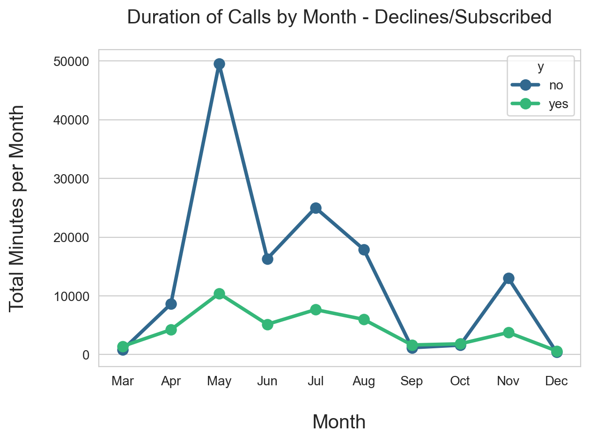
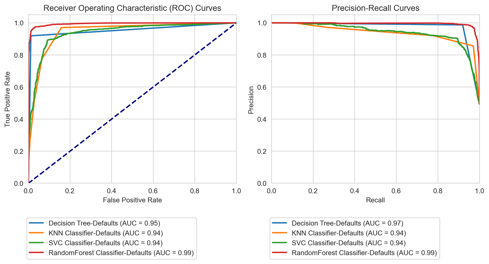
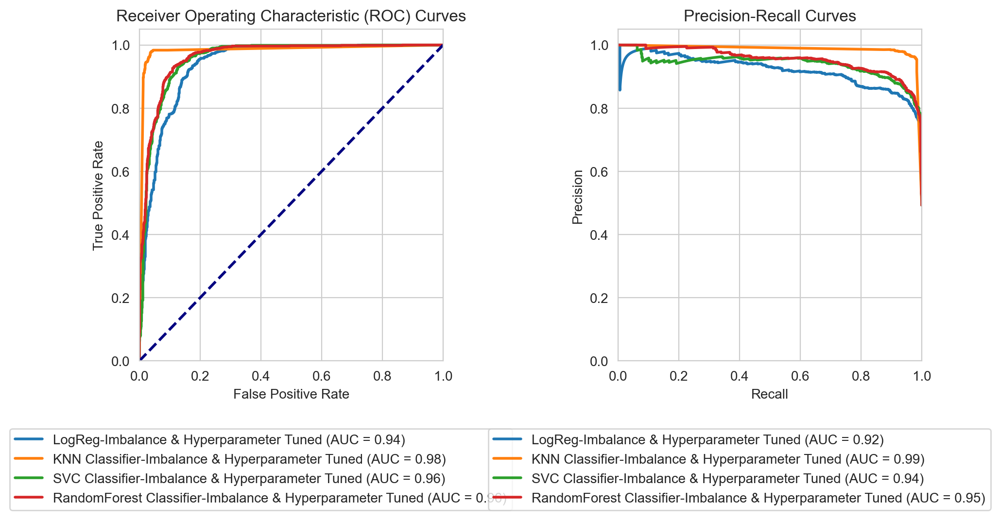

# Comparing Classifiers

[Link to the Jupyter Notebook](https://github.com/Shashidhar-Sathya/campaign/blob/main/bank_of_portugal_direct_mktg.ipynb/)

## Introduction
This project compares performance of following classifiers 
1. K-Nearest Neighbors
2. Logistic Regression
3. Decision Trees
4. Support Vector Machines
5. Random Forest Classifier

The performance is studied by analyzing the dataset by  UC Irvine Machine Learning Repository (https://archive.ics.uci.edu/ml/datasets/bank+marketing). The data is from a Portuguese banking institution and is a collection of the results of multiple marketing campaigns for eliciting long term deposits. 

# <ins>Business Objective</ins>
The objective of this exercise is to compare performances of various classifiers, viz. k-nearest neighbors, logistic regression, decision trees, and support vector machines on the data collected by **<ins>marketing campaign</ins>** carried out by a Portugese Bank between **May 2008 and Nov 2010** for people to sign up for term deposits.  

## Data Understanding, Data Cleaning and Data Preprocessing
The data consists of 41188 records consisting various attributes of the each contacted person.
### Input variables:
1. age (numeric) : **Majority of age group that subscribed to the campaign were below 65 years**
2. job : type of job (categorical: 'admin.','blue-collar','entrepreneur','housemaid','management','retired','self-employed','services','student','technician','unemployed','unknown') : 
3. marital : marital status (categorical: 'divorced','married','single','unknown'; note: 'divorced' means divorced or widowed)
4. education (categorical: 'basic.4y','basic.6y','basic.9y','high.school','illiterate','professional.course','university.degree','unknown')
5. default: has credit in default? (categorical: 'no','yes','unknown')
6. housing: has housing loan? (categorical: 'no','yes','unknown')
7 - loan: has personal loan? (categorical: 'no','yes','unknown')
### Related with the last contact of the current campaign:
8. contact: contact communication type (categorical: 'cellular','telephone')
9. month: last contact month of year (categorical: 'jan', 'feb', 'mar', ..., 'nov', 'dec')
10. day_of_week: last contact day of the week (categorical: 'mon','tue','wed','thu','fri')
11. duration: last contact duration, in seconds (numeric). Important note: this attribute highly affects the output target (e.g., if duration=0 then y='no'). Yet, the duration is not known before a call is performed. Also, after the end of the call y is obviously known. Thus, this input should only be included for benchmark purposes and should be discarded if the intention is to have a realistic predictive model.
### Other attributes:
12. campaign: number of contacts performed during this campaign and for this client (numeric, includes last contact)
13. pdays: number of days that passed by after the client was last contacted from a previous campaign (numeric; 999 means client was not previously contacted)
14. previous: number of contacts performed before this campaign and for this client (numeric)
15. poutcome: outcome of the previous marketing campaign (categorical: 'failure','nonexistent','success')
### social and economic context attributes
16. emp.var.rate: employment variation rate - quarterly indicator (numeric)
17. cons.price.idx: consumer price index - monthly indicator (numeric)
18. cons.conf.idx: consumer confidence index - monthly indicator (numeric)
19. euribor3m: euribor 3 month rate - daily indicator (numeric)
20. nr.employed: number of employees - quarterly indicator (numeric)

Output variable (desired target):
## 21. **y - Has the client subscribed a term deposit? (binary: 'yes','no')**

### Data Cleaning
1. The dataset was already cleaned and there were no nulls in the data.
2. There were 12 duplicates and were deleted
3. Drop 'duration' and 'poutcome'
4. Outlier clean up
    - Age
    - Campaign
    - Duration
    - Previous
 
## EDA - Data Exploration and analysis (Univariate & Bivariate)
The goal is here is to analyse the historical data, visualize using Matplotlib, Seaborn, Pandas etc., and publish the findings on how the participants responded and what factors could have influenced their decision whether to sign up or decline for the deposits.

The data is heavily imbalanced. Out of 41188, 4640 are with positive outcome, i.e only **11%** contacts who signed up for Term Deposit. Remaining **87%** declined.

### Inference
<ins>**Out of 41188, only 4640 clients signed up for the Term Deposits**</ins>

---

## Categorical Values
1. Age : Majority of the contacts were below 69 years of age with majority lying between 30s to 50s.

### Inference:
Out of 4640 clients who accepted, majority of them fall below the age of 69. There are 248 who declined and 221 who accepted beyond age of 69.5. As they are outliers, they can be deleted

---

2. Job : People holding **Admin** job seem to be more inclined to sign up for the deposit, followed by **blue-collar and technician'** job holders
 
 
 ### Inference
**Majority of the subscriptions came from who had 'Admin' jobs with 1352 sign ups**. They were followed by in substantially lower number with people in "Technician", "Blue Collar" and who had "Retired".

--- 

 3. Month: May seems to have performed better in signing up new deposits. 
 
 ### Inference
 Out of 4640 signups, 886 new signup were recorded during this month. <ins>**Perhaps more staff can be deployed to tap in to more customer contacts**</ins>

---

4. Education : Education level does has an influence on clients who sign up for the term deposits.

### Inference
**University Degree** holders and **High school** graduates contribute to maximum signups for the deposits with 1669 and 1031 signing up for the deposits out of total 4640 subscriptions

---

5. Loan: When there is no active loan running, people are willing to sign up for the deposit. Nearly **85%** of people who signed up **did not** have any outstanding loan. i.e around 3850 clients

### Inference
When disposable income is available with the clients, if a suitable option is there for growing it, people will explore term deposits. Out of clients who signed up, 3850 did not have any loans and 663 had an active loan, with 107 of 'unknown' status.

--- 

6. Contact:  Out of 4640 clients, 3852 had cellular phones and balance 787 has Telephone indicating that cellular phone is preferred mode of contact

### Inference
When the contact is initiated on a Cellular phone, 80% of the signup are successful. This looks like a key method for carrying out a campaign.  This should be explored during future campaigns.

---

7. Marital: Married people have higher rate of signing up whether they have 'Housing' loan or not.

### Inference
Among the clients who signed up, 2531 were 'Married', 1620 were 'single' and 476 'divorced' indicating that married clients tend to prefer saving money for the rainy days than other 2 categories.

---

8. Day_Of_Week: This does not seem to have any effect on the sign up chances.  All days have nearly equal chances of new sign ups.

### Inference
Day of the week does not impact on whether clients sign up or not.

---

9. Housing: Housing Loan was equally distributed amongst the one who signed up and those who did not sign up.  Does not see to have any impact on the decision

### Inference
Nearly 55% (2507) of the subscribers have housing loan, while 43% (2025) of the subscribers don't have housing loan. Status of 2% of the subscribers are 'Unknown'.  

## Numerical Features
10. Duration: Length of the earlier contact in seconds. Although majority who receive calls do not sign up, out the client who sign up, is correlated to the length of the call.

### Inference
May month seem to have highest minutes recorded for phone calls.  It also has highest rate of signups for the month.  
- **This is something that can be further explored as an insight for future campaigns**

11. Pdays: Number of days that passed by after the client was last contacted from a previous campaign (numeric; 999 means client was not previously contacted).

### Inference
Highest success is achieved if the **Next** contact is made between **3 to 6 days** after earlier contact.
Highest success rates when the **pdays' is <= 10 days**

---

### Multivariate Correlation
### Signup with Campaign, Pdays, & Previous

12. Previous, Pdays & Campaign: 
    - Previous : Number of contacts performed before this campaign and for this client 
    - Pdays : Number of days since last contact
    - Campaign : Number of contacts performed during current campaign

### Inference
1. There is resonable **Positive** correlation between 'duration' and 'y' indicating that longer the time spent on the phone talking to the potential subscriber, more likely they will sign up for the deposit.
2. There is a resonaable **Negative** correlation between 'pdays' and 'y' indicating that shorter the time between contacts, more likely the potential subscriber, more likely they will sign up for the deposit.
3. There is also **weak positive** correlation between 'previous' and sign up indicating that there is some (not very substantial) impact whether ealier contact was made or not.

---

### Correlation of Y with emp.var.rate, cons.price.idx, cons.conf.idx, euribor3m, nr.employed
13. Correlation between Signup Success vs other Numerical Features: Other numerical features recorded during the campaign were
    - emp.var.rate: employment variation rate - quarterly indicator (numeric)
    - cons.price.idx: consumer price index - monthly indicator (numeric)
    - cons.conf.idx: consumer confidence index - monthly indicator (numeric)
    - euribor3m: euribor 3 month rate - daily indicator (numeric)
    - nr.employed: number of employees - quarterly indicator (numeric)

### Inference
**Negative Correlations with 'y':**
The strongest negative correlations with the target variable 'y' are emp.var.rate, euribor3m, and nr.employed. This suggests that as these variables increase, 'y' tends to decrease, and vice versa.

**Multicollinearity:**
There's high multicollinearity among several predictor variables, especially: 'emp.var.rate', 'euribor3m', and 'nr.employed' are all very strongly positively correlated (above 0.9). This **multicollinearity** can cause issues in some predictive models by making it difficult to isolate the individual effects of each predictor.

--- 

## Summary Statistics of the features

---

# Data Processing - Before Modeling
### Input Features
The Categorical features were standardized using **OneHotEncoding**
The Numerical features were standardized using **StandardScaler**

### Output-Target 
The Target output was encoded from 'Yes/No' to '1/0'

# Modelling
This section explains the various algorithms used to come with a good prediction model. The model performance was evaluated using metrics like

**Fit Time, Training Score, Test Score, Accuracy, Precision, Recall and F1 Score.**

These metrics were derived out **Confusion Matrix**, one of the key outputs of any classifier model.

### Used Algorithms

|    **Algorithm** |               |
| ------------- |-------------------:|
**DummyClassifier**: This classifier ignores the input features and serves as a baseline to compare against other classifiers. Here "strategy" used was "uniform" with "random-state=None".Any improvement in output results by other classifiers indicates that those models are actually **"LEARNING"**.| 
**Logistic Regression**: This classifier tries to predict if the client will sign up for the Term Deposit by using sigmoid function to separate clients who may or may not sign up. | 
**KNN Classifier**: This algorithm implements learning based on the **majority** class of the **nearest neighbors** of each query point. KNN assumes that similar points exists in close proximity| 
**Support Vector Classifier**: These supervised learning algorithms find a line that best divides the given dataset into separate classes and maximize the margins between these classes| 
**Decision Tree Classifier**: Decision Tree Classifier user Inverted Tree to make predictions with most important feature at the top and then branches out based on answers. Every stop has a answer/predcition or another question to branches below. This stops when a prediction is found or has reached the last leaf.|
**Random Forest Classifier**: The Randome Forest Classifier combines multiple decision trees to train on random sample of the data and only uses random subset of features. When predicting of the results is decided by **majority votes**. It is quite powerful tool as it uses **multiple** decision trees for arriving at a decision.|

* Classifier images from "Towards Data Science"

---
# Evaluation

### Evaluation Metrics and Rationale for them
The performance of each of the classifiers are measured using a **Confusion Matrix**
The important metrics are:
1. Precision:

$Precision = \frac{True Positives}{True Positives + False Positives}$

2. Recall:

$Recall = \frac{True Positives}{True Positives + False Negatives}$

3. Accuracy:

$Accuracy = \frac{True Positives + True Negatives}{Total Population}$

4. F1 Score:

$F1 Score = 2 \times \frac{Precision \times Recall}{Precision + Recall}$

**In addition, other metrics are Fit Time, Training Scores, and Test Scores**

## Inference - Dummy Classifier-Baseline Model
As expected the Baseline model with 'Average' 

| Model                                          |   Fit Time |   Train Score |   Test Score |   Accuracy |   Precision |   Recall |   F1 | Confusion Matrix                 |
|:-----------------------------------------------|-----------:|--------------:|-------------:|-----------:|------------:|---------:|-----:|:---------------------------------|
| Baseline-Uniform                               |      0.018 |         50 %   |        49.33% |      49.3% |        11% |     47% |   18% | TN:3607, FP:3658, FN:515, TP:456 |

---
## Inference - LogisticRegression Classifier

| Model                                          |   Fit Time |   Train Score |   Test Score |   Accuracy |   Precision |   Recall |   F1 | Confusion Matrix                 |
|:-----------------------------------------------|-----------:|--------------:|-------------:|-----------:|------------:|---------:|-----:|:---------------------------------|
| Baseline-Uniform                               |      0.018 |         50%   |        49.33%|       49.30%|        11.00%|     47.00%| 18%  | TN:3607, FP:3658, FN:515, TP:456 |
| LogisticRegression-Defaults                    |      0.207 |         91.23%|        90.48%|       90.50%|        66.00%|     40.00%| 5%   | TN:7059, FP:206, FN:578, TP:393  |

From the plot, we see that at Baseline model and Logistic Regression ROC-AUC curves lie on the line indicating about 50% accuracy in prediction. We can also see in P-R curves, both Precision and Recall are  poor. We will use this as **Baseline** and use other algorithms to get better predictions

The **Accuracy of the model was 90%**
The model scored **better** in all evaluation metrics like training score, test scores.  There was improvement in <ins>'Precision'</ins>, but did <ins>worse</ins> than baseline interms of **'Recall'**

---
### Inference - Other Algorithms - KNN, SVC, DecisionTree and RandomForest - with DEFAULT settings
| Model                                          |   Fit Time |   Train Score |   Test Score |   Accuracy |   Precision |   Recall |   F1 | Confusion Matrix                 |
|:-----------------------------------------------|-----------:|--------------:|-------------:|-----------:|------------:|---------:|-----:|:---------------------------------|
| LogisticRegression-Defaults                    |      0.207 |         91.23% |        90.48%|      90.50% |       66.00% |    40.00% | 5%    | TN:7059, FP:206, FN:578, TP:393  |
| KNN-Defaults                                   |      0.874 |         92.86% |        89.8% |      89.80% |       59.00% |    44.00% | 5%    | TN:6968, FP:297, FN:543, TP:428  |
| SVC-Defaults                                   |     56.172 |         92.33% |        90.83%|      90.80% |       68.00% |    42.00% | 52%   | TN:7077, FP:188, FN:567, TP:404  |
| DecisionTreeClassifier-Defaults                |      0.287 |        100%    |        88.74%|      88.70%|       52.00%|    52.00% | 52%   | TN:6800, FP:465, FN:462, TP:509  |
| RandomForest-Defaults                          |      2.258 |        100%    |        91.05%|      91.10%|       67.00% |    48.00% | 56%   | TN:7031, FP:234, FN:503, TP:468  |

Accuracy of all classifiers are around 85-90% All models with default setting show good training score and test score, however they still have poor Precision & Recall scores. We can also see that Training score of BOTH DecisionTree and RandomForest were 100%.  Perhaps there could be **Overfitting**

---

## Hyperparameter Fine Tuning and Cross Validation using GridSearchCV
Here the models are **Fine Tuned** by adjusting the **Hyperparameters** and Cross Validating.  GridSearchCV was used and  <ins>Number of folds for Cross Validation set to 5</ins>

Hyperparameters 

| Model   | Params    | 
|---------|-----|
|Logistic Regression |max_iter=1000; C=[0.1,1,10]
|KNN| n_neighbors=[3,5,]
|SVC| Probability=True, C=[0.1,1], Kernel=['rbf']
|DecisionTree| max_depth=[5,10]

---

| Model                                          |   Fit Time |   Train Score |   Test Score |   Accuracy |   Precision |   Recall |   F1 | Confusion Matrix                 |
|:-----------------------------------------------|-----------:|--------------:|-------------:|-----------:|------------:|---------:|-----:|:---------------------------------|
| LogisticRegression-Fine Tuned                  |      1.786 |         91.23% |        90.48% |       90.50% |        66.00% |     40.00% | 5%    | TN:7059, FP:206, FN:578, TP:393  |
| KNN-Fine Tuned                                 |      2.403 |         92.86% |        89.8%  |       89.80% |        59.00% |     44.00% | 5%    | TN:6968, FP:297, FN:543, TP:428  |
| SVC-Fine Tuned                                 |    338.648 |         92.33% |        90.83% |       90.80% |        68.00%|     42.00% | 52%   | TN:7077, FP:188, FN:567, TP:404  |
| DecisionTreeClassifier-Fine Tuned              |      1.319 |         91.79% |        91.12% |       91.10% |        64.00% |     56.00% | 6%    | TN:6960, FP:305, FN:426, TP:545  |

## Inference :Hyperparameter Fine Tuning and Cross Validation
After fine tuning the hyperparametrs and cross validating, though all the models show high scores in Train Score, Test Score and Accuracy, Precision Recall & F1 score still seem to perform poorly.

**Time to try out adjusting Imbalances using alternative approaches.

---

# Handle Imbalanced Data - SMOTE and Hyperparameter Fine Tuning
To handle the imbalanced data, Synthetic Minority  Oversampling Technique (SMOTE) along with hyperparameter fine tuning was performed for LogisticRegression Classifier, KNN, SVC and RandomForest Classifiers.

Imbalance Handling : **SMOTE with "sampling_strategy"='auto', "k_neighbors"=7**

 
| Model   | Params    | 
|---------|-----|
|Logistic Regression |max_iter=1000; C=[0.1,1,10]; penalty': ['l1','l2'], 'solver': ['liblinear', 'saga'], 'class_weight': [None, 'balanced']| 
|KNN| n_neighbors=[3,5,7], weights:['uniform','distance']|
|SVC| Probability=True, C=[0.1,1], Kernel=['rbf']
|RandomForest| max_depth=[None,5,10], n_estimators:[50,100,200], min_samples_split:[2,5,10]

## Inference - SMOTE and Hyperparameter Fine Tuning

| Model                                          |   Fit Time |   Train Score |   Test Score |   Accuracy |   Precision |   Recall |   F1 | Confusion Matrix                 |
|:-----------------------------------------------|-----------:|--------------:|-------------:|-----------:|------------:|---------:|-----:|:---------------------------------|
| Logreg-Imbalance Fine Tuned                    |    217.718 |         86.66% |        86.07% |       86.10% |        45.00% |     87.00% | 6%    | TN:6246, FP:1019, FN:128, TP:843 |
| KNN-Imbalance Fine Tuned                       |     40.836 |         99.91% |        84.87% |       84.90% |        42.00% |     80.00% | 55%   | TN:6218, FP:1047, FN:199, TP:772 |
| SVC-Imbalance Fine Tuned                       |   1484.16  |         88.03% |        86.4%  |       86.40% |        46.00% |     87.00% | 6%    | TN:6271, FP:994, FN:126, TP:845  |
| RandomForest-Imbalance Fine Tuned              |    534.054 |         89.55% |        87.29% |       87.30% |        48.00% |     85.00% | 61%   | TN:6363, FP:902, FN:145, TP:826  |

<ins>Atlast SOME improvement in **RECALL** score across, KNN, SVC and RandomForest Classifiers.</ins>.  This is primarily due drop in **False Negatives** in the model predictions

### Summary of Results
| Model      | Result    | 
|------------|-----|
|LogisticRegression:| No marked improvement when SMOTE and hyperparameter fine tuning is carried out.  There was show high scores in Train Score, Test Score and Accuracy, No improvement in Precision, Recall & F1 scores. 
|KNN |Some improvement when SMOTE and hyperparameter fine tuning is carried out.  KNN showed high scores in Train Score, Test Score and Accuracy. Here a **BIG improvement** was noticed in Recall with drop in False Negative scores. Precision  & F1 score still seem to perform poorly with continued False Positive scores. 
   |
|SVC |SVC is very long time to build a model when compared to other methods with similar fine tuning parameters. There is SOME improvement when SMOTE and hyperparameter fine tuning is carried out.  SVC showed high scores in Train Score, Test Score and Accuracy and a **BIG improvement** was noticed in Recall with drop in False Negative scores. Precision  & F1 score still seem to perform poorly with continued False Positive scores   |
|Random Forest | Even after using SMOTE to adjust the Imbalanced Data, RandomForestClassifier did not do much better than other TWO classifiers (KNN & SVC) in terms of improving the performance of Precision. It was at about 50%. Though all the models show high scores in Train Score, Test Score, Accuracy and Recall, Precision & F1 score still seem to perform poorly 
  |
---

# Addressing Imbalance
To address imbalance, **Random Under Sampling** technique was used. Here the data was shuffled and same number of samples as successful subscriptions were selected. The split between both 'Yes' number of samples and 'No' number samples were 50%

Intially RandomForest Classifier model was built with the **Under Sampled Data**.  There was **Remarkable** improvement in **Precision, Recall & F1 Scores**.

| Model                                          |   Fit Time |   Train Score |   Test Score |   Accuracy |   Precision |   Recall |     F1 | Confusion Matrix                 |
|:-----------------------------------------------|-----------:|--------------:|-------------:|-----------:|------------:|---------:|-------:|:---------------------------------|
| RandomForest-UnderSampled                      |     44.418 |        93.98% |       88.36% |     88.40% |      85.00% |   93.00% |    89% | TN:788, FP:153, FN:63, TP:852    |

Keeping fingers crossed, other models, viz. LogisticRegression, KNN, SVC  were built.  Remarkably, all the three models were able to improve the performance in all the metrics. Below is the summary of findings

| Model                      |     t Time |    Train Score |    Test Score |     Accuracy |     Precision |    Recall  |  F1   | Confusion Matrix                 |
|:---------------------------|-----------:|---------------:|--------------:|-------------:|--------------:|-----------:|------:|:---------------------------------|
| RandomForest-Under Sampled |     44.418 |         93.98% |        88.36% |       88.40% |        85.00% |     93.00% | 89%   | TN:788, FP:153, FN:63, TP:852    |
| LogReg-Under Sampled       |      0.56  |         87.64% |        86.85% |       86.90% |        85.00% |     88.00% | 87%   | TN:803, FP:138, FN:106, TP:809   |
| KNN-Under Sampled          |      0.396 |         88.78% |        83.89% |       83.90% |        83.00% |     85.00% | 84%   | TN:777, FP:164, FN:135, TP:780   |
| SVC-Under Sampled          |     26.69  |         89.63% |        87.82% |       87.80% |        84.00% |     93.00% | 88%   | TN:777, FP:164, FN:62, TP:853    |
| DTClassifier-Under Sampled |      0.37  |         88.49% |        87.93% |       87.90% |        85.00% |     92.00% | 88%   | TN:788, FP:153, FN:71, TP:844    |

 ALL the algorithms performed remarkably better with **UNDERSAMPLED** data.  RandomForestClassifier performed **MARGINALLY BETTER** than others in comparison. 

**In conclusion, we can see that the imbalance data has more impact than the classifier algorithm used.**

---

# Findings
The objective of this exercise is to compare performances of various classifiers, viz. k-nearest neighbors, logistic regression, decision trees, and support vector machines on the data collected by **<ins>marketing campaign</ins>** carried out by a Portugese Bank between **May 2008 and Nov 2010** for people to sign up for term deposits. 

Five Classifiers were used to build classification models. These models were evaluated how they performed across the following metrics
1. Training Score : How well it predicted the target on the Trained data 
2. Testing Score : How well it predicted the target on the 'Unseen' Test data 
3. Accuracy : Ratio of CORRECT predictions and INCORRECT predictions
4. Precision : Measures the proportion of positive predictions that are actually correct. 
5. Recall : Measures the proportion of actual positive cases that are correctly identified by the model

The provided data was heavily **Imbalanced" in favour of clients/customers NOT signing up. After performing various fine tuning techniques with many different parameters, the models were successfully built.

ALL the five classifiers performed remarkably well and best results came when the **Imbalance** was addressed.  
Out of the 5 classifiers that were used in this model evaluation exercise, "RandomForestClassifier" performed best with highest score in all the above mentioned metrics.  
The rest of the classifiers performed very well too and were only slightly behind in terms of the scores.

## Inferences about the Data
1. Clients below the age of 60 are more inclined to sign up
2. Client with no loan are more inclined to sign up
3. Cellular Phone customers are more likely to sign up
4. Married people are more likely to sign up than with other  marital status
5. Clients who are in 'Admin' and 'Blue Collar' jobs make up the bulk of sign ups
6. University Graduates are likely to subscribe
7. Months of May, Jun, Jul & Aug seem to get bulk of sign ups. Perhaps it is worth while considering campaigns during these months
8. Calling the Clients soon after a contact, between 3 to 6 days,  tends to improve the chance of a sign up
9. Longer the team spends talking to the potential clients, more the chance of a successful sign up
10. Other features like 'poutcome', 'emp.var.rate','cons.price.idx', 'cons.conf.idx','euribor3m','nr.employed' are not correlated with sign ups.

# Conclusion 
### Recommendations 
1. The model can be deployed for evaluation for one or two marketing campaigns and assess the result of the campaign. 
2. The model can be further fine tuned based on the predictions and its subsequent results of the campaigns with additional insights.  
3. Multi-collinear features can excluded and train the model again to assess results.
3. New modeling techniques can carried out to improve the predictions.

### Next Steps
As next steps going forward, I sugges that oncoming set of campaigns, the potential clients should be chosen with keeping following points
1. Client below 60 years of age, married, university graduates and high school graduates, who are working in Admin or Blue collar jobs, preferably over a Cellular phone.
2. It is good to use months of  May, Jun, Jul & Aug to contact clients.
3. Contact them often (not spamming), spend quality time talking and solicit their deposits
4. Explore offering better interest rates, when consumer confidence, consumer price index is high so the clients can save and get better returns.

